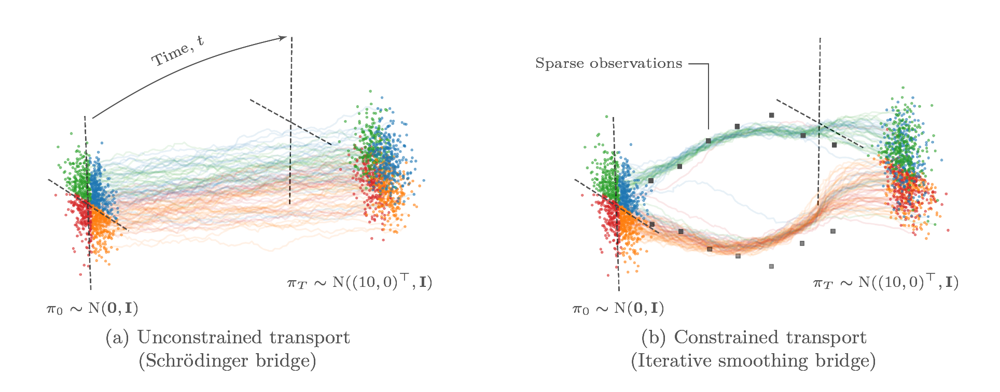

# Iterative Smoothing Bridge

This repository is the official implementation of the methods in the publication:

* Ella Tamir, Martin Trapp, and Arno Solin (2023). **Transport with support: Data-conditional diffusion bridges**. In *Transactions on Machine Learning Research (TMLR)*. [[arXiv preprint]](https://arxiv.org/abs/2301.13636)



The dynamic Schrödinger bridge problem provides an appealing setting for solving constrained time-series data generation tasks posed as optimal transport problems. It consists of learning non-linear diffusion processes using efficient iterative solvers. Recent works have demonstrated state-of-the-art results (e.g., in modelling single-cell embryo RNA sequences or sampling from complex posteriors) but are limited to learning bridges with only initial and terminal constraints. Our work extends this paradigm by proposing the Iterative Smoothing Bridge (ISB). We integrate Bayesian filtering and optimal control into learning the diffusion process, enabling the generation of constrained stochastic processes governed by sparse observations at intermediate stages and terminal constraints. We assess the effectiveness of our method on synthetic and real-world data generation tasks and show that the ISB generalises well to high-dimensional data, is computationally efficient, and provides accurate estimates of the marginals at intermediate and terminal times. 

## Create environment
In the root of this repo, run
```
conda env create --file=isb-env.yaml
conda activate isb-env
pip install -e ./src
```

## Running experiments
The experiments scripts are in the folder `tasks`. To run (non-image) experiments, run the Python file `tasks/isb_tasks/run_iterative_smoother.py`.
To successfully run an experiment, follow these steps:

### Running ISB on flat data
- If you are using a zero drift initialization, no IPFP run is necessary.  If you need an unconstrained Schrödinger bridge model as a reference, run IPFP on flat data first
- Run 
```
conda activate isb-env
python3 tasks/isb_tasks/run_iterative_smoother.py --config-name circle_isb
```
where the config name should match the desired config file.

### Running ISB on MNIST
- If you are using a zero drift initialization, no IPFP run is necessary. If you choose to use a NN drift initialization, set the model name of a trained model here after completing the steps in "Running IPFP on MNIST"
- Run 
```
conda activate isb-env
python3 tasks/isb_tasks/run_iterative_smoother_img.py --config-name mnist_isb
```
We recommend using a GPU for this experiment.

### Running IPFP on flat data
- Run 
```
conda activate isb-env
python3 tasks/bridge_tasks/run_iftp_flat.py --config-name circle2d
```
where the config name should match the desired config file.

### Running IPFP on image data
- Run 
```
conda activate isb-env
python3 tasks/bridge_tasks/run_iftp_image.py --config-name mnist
```
We recommend using a GPU for this experiment.

### List of data sets
To train an ISB model for a data set, first check the list below for the config files and modify them as you like

#### Config files
- 2D sklearn circle: Bridge config in `configs/bridge/circles2d.yaml`, ISB config in `configs/isb/circle_isb.yaml`
- Single-cell: No bridge config, since pre-training an OT model is not necessary here, ISB config in `configs/isb/rna_isb.yaml`
- MNIST: Bridge config in `configs/bridge/mnist.yaml`, ISB config in `configs/isb/mnist_isb.yaml`

## Output
Running the scripts creates model files and plots, below is a description of the folder contents:
- `bridge_models`: Unconstrained model files, to be loaded in ISB training if necessary
- `isb_models`: Trained ISB models
- `plots`: ordered by dataset name and date, includes videos of the learned dynamics and pickled objects from the trained model. The video starting with "final_trajectory_final_particles" shows the result after learning.
- `outputs`: hydra outputs, saves the config file used for each run

## Acknowledgements
We wish to thank Adrien Corenflos for sharing an implementation of differentiable resampling in PyTorch (see `transport_map.py` and `sinkhorn.py`).

## License
This software is provided under the [MIT License](LICENSE).
